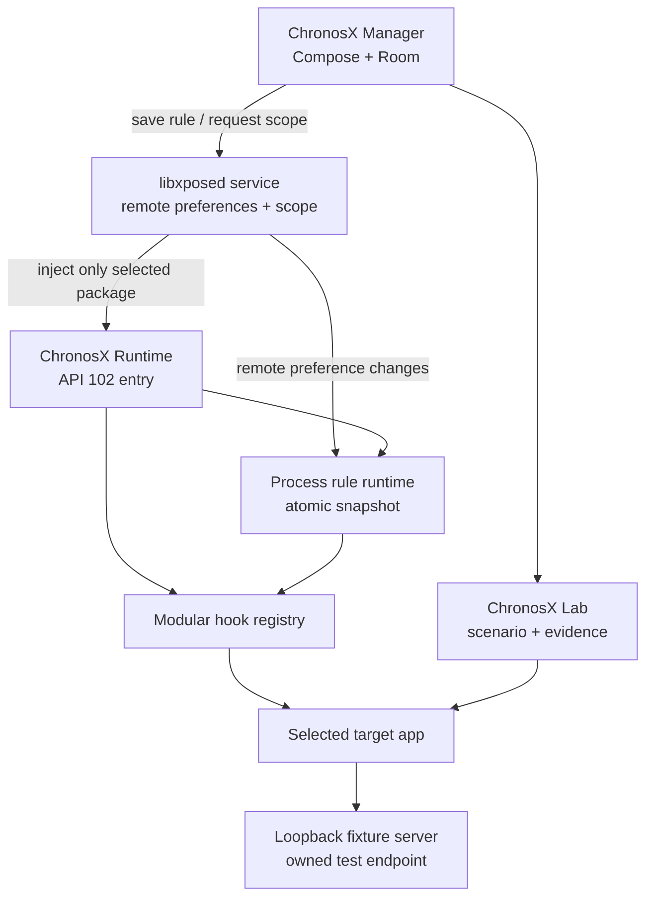

# ChronosX

ChronosX is a scoped Android temporal-resilience platform for libxposed API 102-compatible frameworks, including Vector deployments that expose the modern libxposed service API. It combines per-process time and timezone virtualization with runnable, evidence-producing scenarios for application development, compatibility research, and authorized test environments.

It changes only the time values visible inside package scopes you explicitly enable. It is not a device-wide clock changer and intentionally refuses system packages.

[☕ Support ChronosX](https://buymeacoffee.com/stupidgiraffe)

> [!WARNING]
> Use ChronosX only on devices and applications you own or are authorized to test. It can make an application inconsistent with server-side records, certificates, subscriptions, scheduled jobs, and anti-tampering policies. Server-authoritative applications may not be affected at all.

## Features

- Dynamic, per-package libxposed scope—no global injection.
- Kotlin manager application built with Jetpack Compose and Room.
- Live rule transport over libxposed remote preferences.
- Real-time, offset, and fixed-time wall-clock rules with an explicit IANA timezone policy.
- Separate monotonic-clock policy: physical by default, explicit offset only for lab tests.
- Main-process or all-package-process targeting, immutable rule revisions, and restart state.
- Runnable scenario library: boundary time, TTL/expiry, DST, leap day, multi-process, monotonic, and hybrid-policy tests.
- Portable versioned profile import/export and evidence reports shared as JSON/Markdown text.
- Optional benchmark-result protocol for mock or customer-owned test applications; no companion is required.
- Loopback-only controlled fixture server for staging and mock applications.
- Manager diagnostics for framework status, scope, rule revisions, scenario history, and running hooked targets.
- Guarded modular hook registry: an unavailable surface does not crash the target application or block other hooks.
- Saturating clock arithmetic and monotonic fixed-mode behavior to reduce timeout/scheduler failures.

## Hook coverage

| Surface | Hooked API | Virtualization behavior |
| --- | --- | --- |
| Java wall clock | `System.currentTimeMillis()` | Real, offset, or fixed epoch milliseconds |
| Java monotonic clock | `System.nanoTime()` | Physical by default; explicit monotonic offset only |
| Legacy date | `Date()` | One-time wall-clock transformation |
| Legacy calendar | `Calendar.getInstance()` overloads | One-time wall-clock transformation |
| `java.time` | `Instant.now()` | Virtual instant, preserving sub-millisecond precision for offset mode |
| `java.time` | `LocalDate.now()` | Virtual local date in the target device zone |
| `java.time` | `LocalDateTime.now()` | Virtual local date-time in the target device zone |
| `java.time` | `OffsetDateTime.now()` / `ZonedDateTime.now()` | Virtual wall time in the configured default zone |
| `java.time` | `Clock.systemUTC()` | Rule-backed virtual clock |
| `java.time` | `Clock.systemDefaultZone()` / `Clock.system(ZoneId)` | Rule-backed default or explicit-zone clock |
| Default timezone | `TimeZone.getDefault()` / `ZoneId.systemDefault()` | Physical or configured virtual default zone |
| Android monotonic clock | `SystemClock.elapsedRealtime()` / `elapsedRealtimeNanos()` | Physical by default; explicit monotonic offset only |
| Android monotonic clock | `SystemClock.uptimeMillis()` / `uptimeNanos()` | Physical by default; explicit monotonic offset only where available |

Fixed wall time is exact to milliseconds. Monotonic clocks remain physical by default; ChronosX never derives boot-relative clock values from a wall-clock epoch. This preserves timeout, scheduler, and animation invariants.

## Requirements

- Android 8.1 / API 27 or newer for the manager and `java.time` coverage.
- A framework exposing **libxposed API 102** and the `PROP_CAP_REMOTE` remote-preferences capability. [Vector](https://github.com/JingMatrix/Vector) is one compatibility target.
- A test device on which you are authorized to enable a module and scope the target application.
- Android Studio or JDK 17 for local development.

ChronosX declares `minApiVersion=102`, `targetApiVersion=102`, and `staticScope=false` in `META-INF/xposed/module.prop`. It therefore depends on dynamic scope rather than a broad static scope list.

## Installation

1. Install and configure a compatible libxposed API 102 framework such as Vector on a test device.
2. Download the signed APK from the [latest release](https://github.com/stupidgiraffe/ChronosX/releases/latest), or build locally, then install the manager APK.

   ```bash
   ./gradlew assembleDebug
   adb install app/build/outputs/apk/debug/app-debug.apk
   ```

   Release APKs are signed with the ChronosX release certificate. Android only accepts updates signed by the same certificate, so install release builds consistently rather than mixing debug and release installations.

3. In your framework manager, enable ChronosX as a module. The module entry is packaged at `META-INF/xposed/java_init.list`.
4. Open ChronosX and wait for **Framework connected** on the dashboard.
5. Open **Installed applications**, select a non-system app, choose a rule, and enable it.
6. Accept the framework's scope request if prompted, then force-stop/restart the target app. The Debug screen shows active hooked processes when the framework exposes them.

Saved rules remain in Room while the framework is unavailable. Use **Sync saved rules** after reconnecting to send them to remote preferences and request scope.

## Configuring time rules

| Mode | Example | Result |
| --- | --- | --- |
| `REAL_TIME` | Default | The app sees the device clock unchanged. Helpful for confirming scope. |
| `OFFSET` | `+86400000` | The app sees tomorrow (`real time + 1 day`). Negative offsets provide yesterday. |
| `FIXED_TIME` | `2027-01-01 12:00` | The app sees a chosen local timestamp. |

The rule editor uses date/time pickers, an IANA timezone chooser, presets, process policy, and a live **Preview now** control. Invalid partial timestamps cannot be saved.

## ChronosX Lab

ChronosX Lab turns a temporal rule into a reproducible authorized test run:

1. Choose a built-in scenario and an installed target app.
2. ChronosX saves a new immutable rule revision and requests target launch.
3. An optional mock or customer-owned app receives the run metadata through its launch intent and can return a benchmark result broadcast.
4. ChronosX records the lifecycle, rule revision, optional observed values, and an exportable report.

Business-hours testing is only one local-policy fixture. The included scenario catalog also covers cache/TTL expiry, daylight-saving transitions, leap days, process consistency, monotonic behavior, and client-versus-controlled-backend disagreement.

### Controlled fixture server

The `lab-server` module is a real, loopback-only fixture server for apps that point to an owned mock or staging endpoint:

```bash
./gradlew :lab-server:run
```

It serves deterministic `valid`, `expired`, `stale`, `denied`, `retryable`, and malformed-contract responses at `GET /v1/time-policy`. See [lab-server/README.md](lab-server/README.md). It is not a proxy and does not intercept production traffic.

### Benchmark protocol

An authorized mock app can report an assertion with an explicit broadcast to `dev.chronosx`. The receiver stores the result as self-reported benchmark evidence; it never claims to prove behavior of an arbitrary third-party app. The contract is documented in [docs/benchmark-protocol.md](docs/benchmark-protocol.md).

## Safety model

ChronosX makes several intentional safety choices:

- `android`, `system`, `com.android.*`, malformed packages, and `dev.chronosx` are rejected by `PackageTargetPolicy`.
- The manager writes remote preferences before requesting dynamic scope.
- Every hook uses libxposed `ExceptionMode.PROTECTIVE`; hook exceptions fall back to the original behavior.
- Higher-level Java date/time APIs use an internal construction bypass so a rule is applied exactly once rather than doubled through `System.currentTimeMillis()`.
- Remote preference changes replace an immutable process snapshot atomically.
- Rule revisions, schema versions, process policy, zone policy, and monotonic policy travel together.
- Each hook surface is represented in a versioned capability registry shared by runtime and manager documentation.
- The module checks both API 102 and remote-preference capability before activation.

## Limitations

ChronosX virtualizes selected Java and Android framework APIs. It cannot guarantee coverage of:

- server-authoritative time, signed timestamps, or remotely validated entitlements;
- native/JNI clock calls, direct syscalls, or application-specific clock implementations;
- values already cached before the module is activated;
- calls optimized or inlined by ART in ways a framework cannot intercept;
- applications that intentionally detect framework injection or reject altered time.

ChronosX does not alter server-authoritative entitlements, integrity verdicts, signed timestamps, or unrelated application traffic. Use the controlled fixture server or a customer-owned staging backend for hybrid-policy testing.

Always test with a disposable account/data set and expect a target restart when first enabling a rule.

## Architecture



More detail is in [docs/architecture.md](docs/architecture.md).

## Development

```bash
git clone https://github.com/stupidgiraffe/ChronosX.git
cd ChronosX
./gradlew test
./gradlew assembleDebug
./gradlew :lab-server:test
```

The project uses Gradle Kotlin DSL, Kotlin, Jetpack Compose, Room, a loopback fixture server, and `io.github.libxposed:api:102.0.0`. Unit tests cover clock arithmetic, zone resolution, profile interchange, scenario catalog coverage, remote preference decoding, package filtering, and controlled fixture responses.

### Release builds

`assembleRelease` produces an unsigned APK unless all four signing properties below are supplied. This keeps private key material out of the repository while allowing a reproducible signed release build.

```bash
./gradlew :app:assembleRelease \
  -Pchronosx.releaseStoreFile=/absolute/path/chronosx-release.p12 \
  -Pchronosx.releaseStorePassword='…' \
  -Pchronosx.releaseKeyAlias=chronosx-release \
  -Pchronosx.releaseKeyPassword='…'
```

The release workflow consumes the equivalent GitHub Actions secrets and uploads `ChronosX-<release-tag>.apk`. Never commit a keystore, password, or signed APK.

For framework API details, use the official [libxposed API](https://github.com/libxposed/api) and [libxposed service](https://github.com/libxposed/service) documentation rather than legacy Xposed API examples.

## Contributing and security

Please read [CONTRIBUTING.md](CONTRIBUTING.md) before opening an issue or pull request. Report vulnerabilities using [SECURITY.md](SECURITY.md), not a public issue.

## Support

If ChronosX is useful in your development or compatibility research, you can [buy its maintainer a coffee](https://buymeacoffee.com/stupidgiraffe).

## License

ChronosX is licensed under the [Apache License 2.0](LICENSE).
