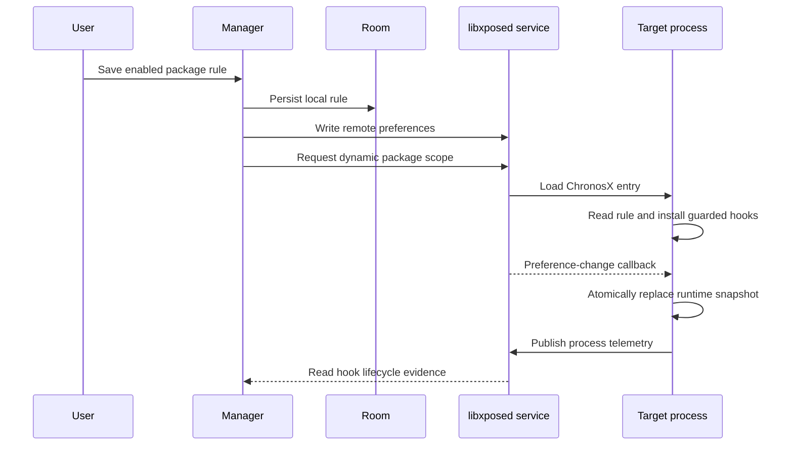

# Architecture

ChronosX is intentionally split between a manager process and a module runtime. The manager never performs hooks; the module never owns UI or durable local configuration.

## Modules

| Area | Responsibility |
| --- | --- |
| `core` | Pure temporal rule/profile/scenario model, clock arithmetic, zone resolution, capability catalog, date-matrix/runtime-telemetry codecs, and package targeting policy. JVM-testable and Android-free. |
| `app:data` | Room entities/DAOs, installed-app discovery, custom scenarios, scenario evidence, target launch, libxposed service bridge, and configuration synchronization. |
| `app:ui` | Compose manager, timezone picker, process/monotonic policy controls, profiles, custom Scenario Builder, runtime capability matrix, and report sharing. |
| `app:module` | libxposed API 102 entry point, remote-rule runtime, process telemetry publisher, and modular hook registry. |
| `lab-server` | Loopback-only controlled fixture service for mocks, staging builds, and authorized test targets. |

## Rule lifecycle

Persisting to Room first gives the manager a recoverable source of truth when the framework service is unavailable. The user can later synchronize all stored rules.

## Runtime invariants

1. A target must pass `PackageTargetPolicy` before the module reads its preferences or installs hooks.
2. The framework must expose API 102 and remote preferences.
3. A process runtime owns one package rule snapshot, process policy, and physical monotonic anchor.
4. Every hook uses libxposed protective exception handling.
5. Rule state is swapped atomically; no hook reads partially updated fields.
6. Internal source-clock reads run under a thread-local bypass.
7. Fixed wall-clock values never become boot-relative monotonic values.
8. A virtual default zone is opt-in and falls back to the device zone if malformed.
9. A shared process with a second independently selected package produces an explicit runtime
   conflict telemetry record; ChronosX never merges distinct package rules into one process.

The bypass is particularly important for `Date()`, `Calendar.getInstance()`, and `Instant.now()`: those APIs may delegate to other hooked APIs. ChronosX lets the nested source call stay real, then applies the rule once to the completed object.

## Time model

`TimeEngine` is the single source of arithmetic and zone resolution:

- `REAL_TIME`: returns the physical result.
- `OFFSET`: uses saturating addition so malformed values cannot wrap from `Long.MAX_VALUE` to the distant past.
- `FIXED_TIME`: returns the requested fixed epoch for wall-clock APIs.
- `ZoneMode.VIRTUAL_DEFAULT`: resolves a validated IANA `ZoneId` for default-zone paths.
- `MonotonicMode.PRESERVE`: passes physical elapsed/uptime/nano sources through unchanged.
- `MonotonicMode.OFFSET`: applies an explicit independent interval-clock offset for an authorized scenario.

The runtime records a physical monotonic anchor for diagnostics, but fixed wall-clock mode never alters
monotonic values by default. This preserves timeout and scheduler invariants.

## Lab execution and evidence

`ScenarioCatalog` supplies immutable package-independent templates. `CustomScenario` supplies
persisted, editable manual policies. Running either form snapshots the complete scenario, persists a
fresh rule revision, asks the framework for dynamic scope, launches the target with optional
controlled-fixture metadata plus a per-run correlation token, and creates a durable `scenario_runs`
evidence record. A cooperative
mock app may return a benchmark result broadcast and a date-capability matrix; both are stored as
self-reported evidence rather than treated as a claim about arbitrary app behavior. The token avoids
accidentally associating another app's broadcast with the run; it is not target authentication.

The manager exports a JSON or Markdown report from the run record. The loopback-only `lab-server`
returns deterministic fixture policies for an app that has been deliberately configured to use an
owned test endpoint.

## Extending the registry

To add a clock surface:

1. Add a `HookId` and a `ChronosHook` implementation in `HookRegistry`.
2. Install it through `protectiveHook` or another guarded helper.
3. Use `ProcessRuleRuntime` rather than calling a clock API directly.
4. Audit whether the surface can delegate to another hook; use `withConstructionBypass` when needed.
5. Add pure arithmetic or codec tests where behavior changes, then add the surface to the authorized
   `DateCapabilityProbe` or a customer-owned benchmark assertion before calling it supported.

Do not add a broad hook that runs in every process. Scope is the primary safety boundary of the project.
