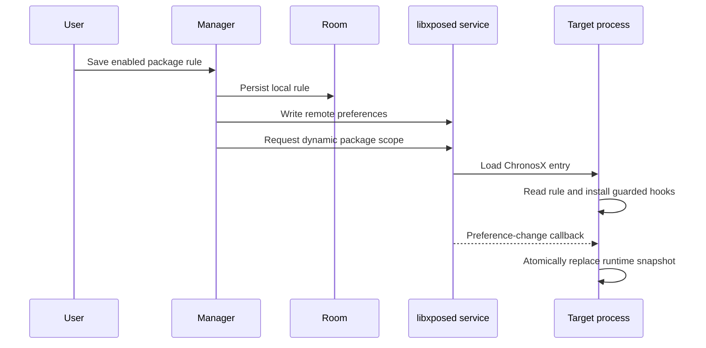

# Architecture

ChronosX is intentionally split between a manager process and a module runtime. The manager never performs hooks; the module never owns UI or durable local configuration.

## Modules

| Area | Responsibility |
| --- | --- |
| `core` | Pure `TimeRule`, `TimeEngine`, preference wire codec, and package targeting policy. JVM-testable and Android-free. |
| `app:data` | Room entities/DAOs, installed-app discovery, libxposed service bridge, and configuration synchronization. |
| `app:ui` | Compose manager screens and rule preview. |
| `app:module` | libxposed API 102 entry point, remote-rule runtime, and modular hook registry. |

## Rule lifecycle

Persisting to Room first gives the manager a recoverable source of truth when the framework service is unavailable. The user can later synchronize all stored rules.

## Runtime invariants

1. A target must pass `PackageTargetPolicy` before the module reads its preferences or installs hooks.
2. The framework must expose API 102 and remote preferences.
3. A process runtime owns one package rule snapshot and one monotonic anchor.
4. Every hook uses libxposed protective exception handling.
5. Rule state is swapped atomically; no hook reads partially updated fields.
6. Internal source-clock reads run under a thread-local bypass.

The bypass is particularly important for `Date()`, `Calendar.getInstance()`, and `Instant.now()`: those APIs may delegate to other hooked APIs. ChronosX lets the nested source call stay real, then applies the rule once to the completed object.

## Time model

`TimeEngine` is the single source of arithmetic:

- `REAL_TIME`: returns the physical result.
- `OFFSET`: uses saturating addition so malformed values cannot wrap from `Long.MAX_VALUE` to the distant past.
- `FIXED_TIME`: returns the requested fixed epoch for wall-clock APIs.

Monotonic APIs use an anchor. For fixed mode, they begin at the fixed-time-derived anchor but continue to advance by the physical elapsed delta. This prioritizes process liveness over a fully frozen scheduler.

## Extending the registry

To add a clock surface:

1. Add a `HookId` and a `ChronosHook` implementation in `HookRegistry`.
2. Install it through `protectiveHook` or another guarded helper.
3. Use `ProcessRuleRuntime` rather than calling a clock API directly.
4. Audit whether the surface can delegate to another hook; use `withConstructionBypass` when needed.
5. Add pure arithmetic or codec tests where behavior changes, and validate on a disposable target application.

Do not add a broad hook that runs in every process. Scope is the primary safety boundary of the project.
